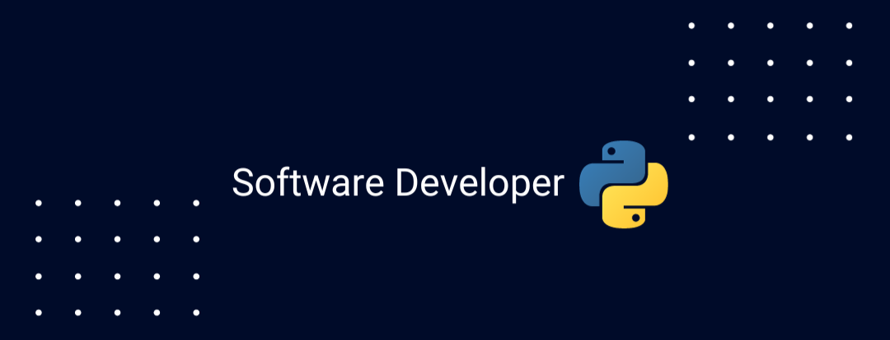

# ¡Hola! 👋 Soy Xavier Pérez Jiménez

¡Hola! Soy un apasionado desarrollador backend con experiencia en una variedad de tecnologías, incluyendo Django, PostgreSQL, MongoDB, Python, Docker y Git. Me dedico al emocionante mundo del desarrollo web, centrándome en la creación de aplicaciones sólidas y eficientes utilizando el poderoso framework Django. Desde la configuración de bases de datos con PostgreSQL hasta la implementación de soluciones flexibles con MongoDB, mi experiencia abarca un amplio espectro. Python es mi aliado constante en la creación de proyectos web dinámicos y escalables. Siempre estoy buscando nuevos desafíos y oportunidades para seguir creciendo en este fascinante campo. 🚀

## Conéctate conmigo

¡Puedes encontrarme en LinkedIn! [Xavier Pérez Jiménez](https://www.linkedin.com/in/xavierperezjimenez/)

¡Hablemos de código! 😄

