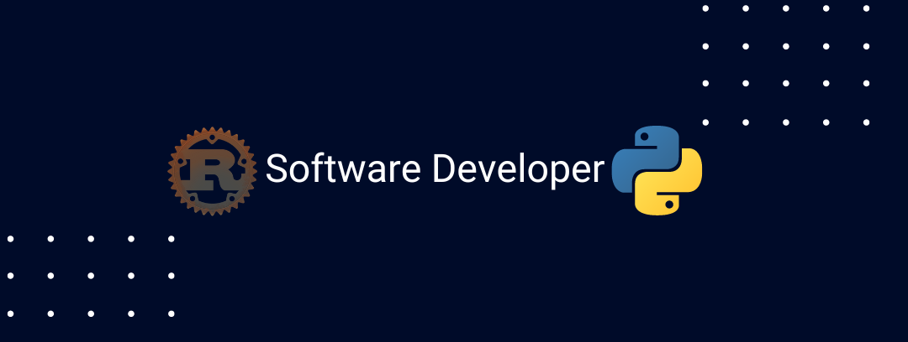

# ¡Hola! 👋 Soy Xavier Pérez Jiménez




¡Hola! Soy un apasionado desarrollador backend con una sólida experiencia en una amplia gama de tecnologías de vanguardia. Especializado en el desarrollo web con el poderoso framework Django, he demostrado habilidades excepcionales en la creación de aplicaciones sólidas y eficientes que impulsan el éxito empresarial.

Mi experiencia abarca desde la configuración de bases de datos con PostgreSQL hasta la implementación de soluciones flexibles con MongoDB, asegurando una infraestructura robusta y escalable para cualquier proyecto. Utilizo Python como mi lenguaje de elección, aprovechando su versatilidad y potencia para desarrollar proyectos web dinámicos y escalables.

Además, estoy completamente familiarizado con tecnologías modernas como Docker y Git, lo que me permite crear entornos de desarrollo eficientes y colaborativos. Mi enfoque orientado a resultados y mi pasión por la resolución de problemas me han permitido enfrentar desafíos complejos con éxito y superar las expectativas del cliente en cada paso del camino.

Estoy buscando activamente nuevas oportunidades donde pueda aplicar mi experiencia y contribuir al crecimiento y éxito de una empresa innovadora. Si buscas a un desarrollador backend comprometido con la excelencia y la innovación, ¡no dudes en contactarme! Estoy listo para impulsar tu proyecto hacia nuevos horizontes. ¡Vamos a construir algo increíble juntos! 🚀

```bash
# Tecnologías de Front-end
echo "| Tecnologías de Front-end | Nivel de Dominio |"
echo "|--------------------------|------------------|"
echo "| HTML                     | ████████████ (99%) |"
echo "| Markdown                 | ████████████ (80%) |"
echo ""

# Tecnologías de Back-end
echo "| Tecnologías de Back-end  | Nivel de Dominio |"
echo "|--------------------------|------------------|"
echo "| Python                   | ██████████████ (96%) |"
echo "| Django                   | ██████████████ (95%) |"
echo "| Django REST framework    | ██████████████ (91%) |"
echo "| Rust                     | ██████████ (50%) |"
echo "| PostgreSQL               | ██████████ (50%) |"
echo "| MongoDB                  | ██████████ (50%) |"
echo "| Redis                    | ████████████ (60%) |"
echo ""

# Herramientas de Desarrollo
echo "| Herramientas de Desarrollo | Nivel de Dominio |"
echo "|----------------------------|------------------|"
echo "| Docker                     | ██████████████ (100%) |"
echo "| Git                        | ████████████ (60%) |"
echo ""

# Otras Habilidades
echo "| Otras Habilidades              | Nivel de Dominio |"
echo "|--------------------------------|------------------|"
echo "| Inglés                         | ████████ (30%)  |"
echo "| Emprendimiento                 | ██████████████ (100%) |"
echo "| Desarrollo de Microservicios  | ██████████████ (100%) |"
echo "| Arquitectura de Software      | ██████████████ (99.5%) |"
echo "| Tecnología de la Información (TI) | ██████████████ (99.4%) |"
echo "| Comunicación                   | ██████████████ (100%) |"
echo "| Trabajo en Equipo              | ██████████████ (100%) |"
echo "| Resolución de Problemas        | ██████████████ (100%) |"
```

## Conéctate conmigo

¡Puedes encontrarme en LinkedIn! [Xavier Pérez Jiménez](https://www.linkedin.com/in/xavierperezjimenez/)

¡Hablemos de código! 😄

